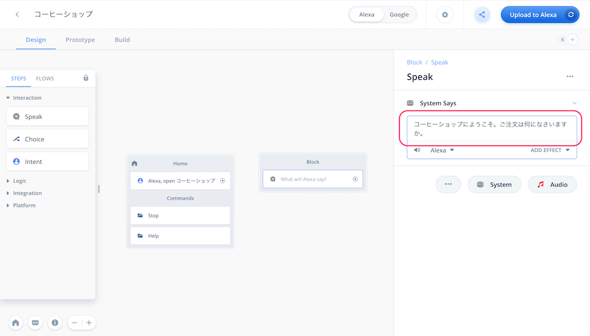
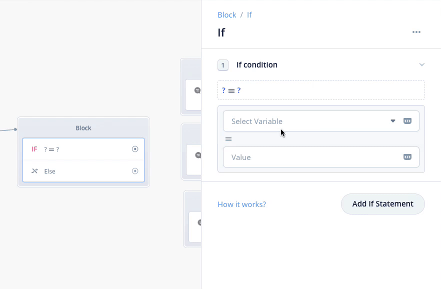
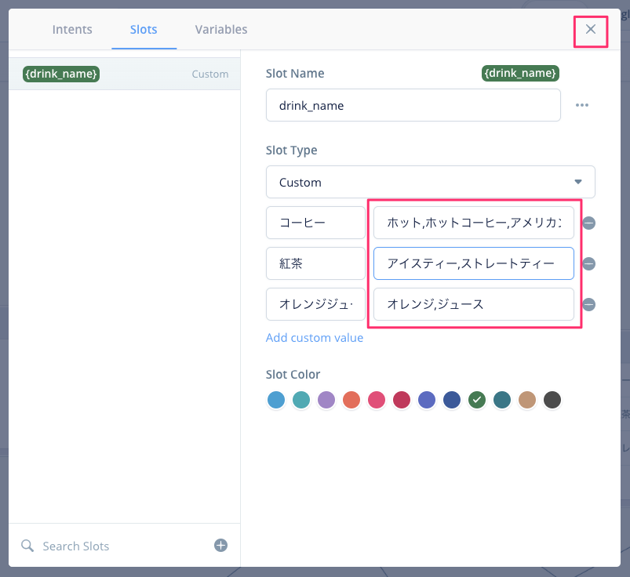

# Voiceflow日本語チュートリアル ① はじめてのAlexaスキル開発

## 概要


Voiceflowを使ったノンコーディングではじめるAlexaスキル開発の日本語チュートリアルシリーズです。

第1回は「はじめてのAlexaスキル開発」です。かんたんなスキルを作ってVoiceflowの操作になれていきましょう。

### はじめに

VoiceflowでAlexaスキルを開発するには事前に以下が必要です。

- Amazon.co.jpアカウント
- Alexa開発者アカウント
- Voiceflowアカウント

まだの方は以下のページを参考に作成してください。
[https://vf-handson-setup.netlify.app/](https://vf-handson-setup.netlify.app/#0)

### 注意

Negative
: 本手順書は2020年6月11日時点のものですが、Voiceflowの開発はかなり活発なので、本手順書通りに進めてもうまくいかない場合や画面が変更されている場合があります。ご容赦ください。（必要な場合は補足します）

Positive
: 不具合やお気づきの点があれば、[https://github.com/kun432/voiceflow-handson-01-202006/issues](https://github.com/kun432/voiceflow-handson-01-202006/issues)に記載してください

### 更新履歴

- 2020/06/11   公開

ではNextをクリックしてください。

## プロジェクトの新規作成

### プロジェクトの新規作成

[https://voiceflow.com/](https://voiceflow.com/)にアクセスし、"Log in"をクリックしてログインします。


プロジェクトの一覧画面が開きます。"Create Project"をクリックして、プロジェクトを新規作成します。


プロジェクトの情報を入力します。以下の通りに入力して、"Create Project"をクリックします。


| | |
|-----------|------------|
| **項目** | **入力内容** |
| *Enter your project name* | プロジェクト名を入れます。「**コーヒーショップ**」と入力します。|
| *Select Regions* | 言語を選択します。**"Japanese(JP)"**にチェックを入れて、**"English(US)"**のチェックを外します。 |

プロジェクトが作成されました！

ではNextをクリックしてください。

## Voiceflowの基本操作とスキル開発の流れ

### 画面の説明

最初にVoiceflowの画面の説明をかんたんにしておきます。全部を覚える必要はありません。使いながら覚えていきましょう。


| | |
|-----------|------------|
| **項目** | **入力内容** |
| *ステップ/ブロックメニュー* | 機能ごとに分けられたブロックが並んでいます。使いたいブロックをここから選びます。 |
| *キャンバス* | ステップ/ブロックメニューから選んだブロックをここに配置し、線でつなげていくことで会話フローを作っていきます。|
| *Homeブロック* | 最初から用意されているのがブロックです。ここから会話フローがスタートし、他のブロックにつなげていきます。なお、Homeブロックは削除することはできません。|
| *アップロードボタン* | 作成したプロジェクトをAlexa／Google Homeそれぞれのプラットフォームにアップロードします。アップロードすることでAmazon EchoやGoogle Homeなどのスマートスピーカデバイスから利用可能となります。|
| *メニュー切り替えタブ* | メニューの切り替えを行います。会話フローを作成するDesignメニュー、会話フローを実際に動かしてテストを行うPrototypeメニュー、作成したスキルを申請するBuildメニューがあります。|
| *キャンバスコントロールメニュー* | Homeブロックに戻る、キャンバスの拡大・縮小などが行なえます。また対話モデルを作成する「対話モデルマネージャー」や、ドキュメントやチュートリアルなどへのリンクもあります。|
| *Alexa/Google切り替えスイッチ* | 作成したプロジェクトをAlexa向け／Google Home向けに切り替えます。デフォルトはAlexaになっています。|
| *設定ボタン* | スキルの動作に関する設定を行います。|
| *テスト共有ボタン* | 作成したプロジェクトのテストをかんたんに共有できるリンクを発行します。|
| *コラボレーター追加ボタン* | 有償プランで利用可能な、リアルタイムコラボレーションのユーザを追加します。|
| *サポートボタン* | Voiceflowへの質問やバグ・要望の報告が行なえます。|

### 今回作成するサンプルスキルについて

では実際にサンプルスキルを作りながらやっていきましょう。今回作成するスキルはこんな感じです。


Alexaスキルでは、最初の「アレクサ、コーヒーショップをひらいて」でスキル「コーヒーショップ」が呼び出されるようになっています。したがって、それ以降の会話フローをVoiceflowで作っていくことになります。

### ブロックの配置

まず、ユーザの呼び出しをうけて、Alexaが「コーヒーショップにようこそ。ご注文は何になさいますか？」と発話するところを作っていきましょう。Alexaに発話させるには「**Speakブロック**」を使います。

左のステップ/フローメニューから、"Speak"と書かれたブロックをHomeブロックの右側にドラッグ＆ドロップします。


ブロックが配置されました。右側に入力欄が表示されますので、以下のように入力します。

```
コーヒーショップにようこそ。ご注文は何になさいますか？
```



Homeブロックの中にある「Alexa, open コーヒーショップ」の右端にある丸いアイコンを一度クリックすると、ブロック同士を線でつなげられるようになります。Speakブロックのタイトルの左端あたりまで線を引っ張って、もう一度クリックして線をつなげます。


Negative
: 以下のように違うところに線がつながる場合もあるかと思います。<br/><br/>

<br/><br/>**線を繋ぐ場所には実は意味があります**（これについては後で説明します。）ただし、現時点ではこれでも問題ありませんのでそのまま進めてOKです。もし修正したい場合は以下の手順で線を引き直してください。
 - 線の始点をもう一度クリックすると線を引き直せます。
 - 先の真ん中あたりにカーソルをあわせると表示されるゴミ箱アイコンをクリックすると線が削除されますので、再度線を引いてください。


これで短いながらも会話フローがつながりました。ではさっそくテストしてみましょう。

### Alexa開発者コンソールへのアップロード

作成したスキルをテストするにはAlexa開発者コンソールへのアップロードが必要です。右上の"Upload to Alexa"というボタンをクリックしてください。


初回にかぎり、VoiceflowアカウントとAlexa開発者アカウントの紐付けが必要になります。"Connect Amazon"ボタンをクリックしてください。


Amazonアカウントのログイン画面が出てきますので、お持ちのAmazonアカウントでログインします。


VoiceflowからAmazonアカウント経由でAlexaスキル作成等の許可を求める画面が出てきますので、「許可」をクリックします。これでアカウントの紐付けは完了です。


アップロードが行われます。100%になるまで待ちます。


100％になって"Upload Successful"と表示されればアップロード完了です。ではAlexa開発者コンソールでテストしましょう。"Test on Alexa Simulator"をクリックしてください。


Alexa開発者コンソールのログイン画面が表示されたら、Amazonアカウントでログインしてください。


Alexa開発者コンソールのテストシミュレータ画面が表示されます。作成したスキルはここでほぼ実機と同じようにテストができます。


テストは文字だけでなく音声でも行なえますので、マイクは有効にしておきましょう。「許可」をクリックします。


なお、この時、左上のところで「非公開」が選択されていた場合は「開発中」に変更します。


ではいよいよテストです。「日本語」が選択されていることを確認して、マイクアイコンをクリックしたままマイクに「コーヒーショップを開いて」と話しかけて、話し終わったら放してみてください。パソコンにマイクがない場合は、キーボードから入力してENTERキーを押してください。


あなたの発話に対して、Voiceflowで設定した内容をAlexaが返してくれればテストは成功です！これでスキル開発の第一歩を踏み出したことになります！おめでとうございます！


このように、Voiceflowでスキルを作成 → Alexa開発者コンソールにアップロード → Alexa開発者コンソールでテスト、というのがVoiceflowでのスキル開発の流れになります。

Nextをクリックしてください。

## ユーザの発話を受け取って分岐する

Alexaが「ご注文は何になさいますか？」と注文を聞くところまでできたので、次は、ユーザの注文を受け取って、それに応じて異なる返事をするようにしましょう。今回、メニューは以下の3品とします。

- コーヒー（350円）
- 紅茶（300円）
- オレンジジュース（400円）

ユーザからの「発話」を受け取るには「**Choiceブロック**」を使います。左のステップ/フローメニューから、"Choice"と書かれたブロックをSpeakブロックの右側にドラッグ＆ドロップして、線でつないでください。


Choiceブロックは分岐（Path）ごとに設定を行います。今回の例だと、コーヒー・紅茶・オレンジジュースの3つの設定が必要になります。やり方は同じなので、まずはコーヒー用の分岐を作っていきましょう。

まず分岐の名前を入力します。右の設定画面の入力欄に「**coffee**」と入力して、そのすぐ下の「Create」をクリックします。


"coffee"という名前の分岐が登録され、新たに"Utterances"という項目が下に追加されます。ここには、コーヒーを注文する場合にユーザが言いそうな発話をいくつか入力します。たとえば、以下のような例が考えられますね。

- 「コーヒーをちょうだい」
- 「コーヒーをお願いします」
- 「コーヒーをください」
- 「コーヒー」

これを"Utterances"と書いてあるすぐ下の入力欄に入力し、最後にENTERキーで登録します。


以下のように入力欄の下に表示されればOKです。


これを繰り返して、以下のようにいくつかの発話バリエーションを入力します。バリエーションが多ければ多いほど、ユーザのいろんな言い方に対応できるということになります。


これで1つ目の分岐の設定が終わりました。2つ目の分岐の設定を行いましょう。下にある"Add Path"をクリックしてください。


新たに2つ目の分岐（Path）と入力欄が追加されていますね？Choiceブロックではこのようにして分岐を作っていくことになります。


では続けて、紅茶とオレンジジュースについてもそれぞれ分岐を作ってみてください。最終的に以下のようになればOKです。（長いので分割しています）


では、それぞれの分岐に応じた回答をAlexaにさせましょう。Choiceブロックのそれぞれの分岐にSpeakブロックをつないで、以下のような発話内容を設定してください。


もしかするとユーザの発話があらかじめ想定したものでない場合も考えられますね。Choiceブロックのそれぞれの分岐で設定した発話バリエーションにどれも合致しない場合は、"**Else**"という分岐に流れます。ここにSpeakブロックをつなげて、もう一度ユーザに別の発話を再度うながすようにします。


そして再度Choiceブロックに戻せばOKです。


Choiceブロックでは会話フローの分岐を行いましたが、逆に複数の会話フローを合流させて1つにすることもできます。Choiceブロックで分岐した3つのSpeakブロックの右側にもう1つSpeakブロックをおいて、以下のように線でつなげます。


このようにして、フローを分岐・合流しながら会話のフローを作っていきましょう。

### テスト

では実際にテストで試してみましょう。"Upload to Alexa"をクリックして、Alexa開発者コンソールにアップロードしてテストします。設定したとおりに注文ができるか試してみてください。

ちゃんといろんな言い方に対応できていますね！メニューにないものを頼んでみたらどうなるでしょうか？


こちらもちゃんと動いてますね！


では少し意地悪なテストをしてみましょう。


「じゃあコーヒーで」という想定していない表現でもきちんと認識できていると同時に、メニューにない注文を間違って認識していますね・・・

なぜかというと、Alexaは人間のように「文脈」を理解しているわけではなく、Alexaが持っている多数の発話データをもとに「統計的」な推測をしているだけなのです。したがって、うまく解釈してくれる場合もあれば、時には間違った解釈をする場合もあります。この解釈の精度はを上げるためには、Alexaがより正しく認識しやすい形にしてあげる必要があります。

それが「**対話モデル**」になります。 

対話モデルについては以降の章で説明します。Nextをクリックしてください。

## スキルを楽しくするためのテクニック

対話モデルの説明に進む前に、少し息抜きをしましょう。

ここまでの章で、Voiceflowを使って基本的な会話のやり取りができるようになりました。でもこういうふうにも感じませんでしたか？

- Alexaのおしゃべりが機械的で人間ぽくない
- Alexaとユーザが単に喋っているだけで雰囲気が楽しくない

この章では、Alexaをより人間らしく、スキルをより楽しくするためのかんたんなテクニックをいくつかご紹介します。

### Alexaの声を変える

Speakブロックの入力欄の下にあるドロップダウンリストから、Alexaの声を変えることができます。


日本語の場合は、標準のAlexaに加えて、

- Mizuki（女性）
- Takumi（男性）

の3種類の声が選べます。変更してアップロードして試してみてください。ちなみにこんな感じです。

- [Alexa](https://www.dropbox.com/s/e4f2eevre9lbkzn/alexa.m4a?dl=0)
- [Mizuki](https://www.dropbox.com/s/dqigwvbf6o2tg91/mizuki.m4a?dl=0)
- [Takumi](https://www.dropbox.com/s/a99wy0ax8aisyjh/takumi.m4a?dl=0)

これらをうまく使い分けて、複数のキャラクターが登場するようなスキルにしてもおもしろいですね。

Negative
: 他の言語の声も選択できますが、そのままではカタコトの発音になったり、発話されなかったりします。
ただしく発話させるためには、SSMLという音声を調整するためのマークアップ言語を使って「話させたい言語」を指定する必要がありますが、ここでは割愛します。

### Alexaの話し方を調整する

Alexaの話し方を調整することもできます。「**SSML**」というHTMLに似たタグを入力して発話内容を囲むことで、発話の高低やスピードなどを変えることができますが、VoiceflowではSSMLエディターが用意されているのでGUIでかんたんに行えます。

最初のSpeakブロックをクリックして設定画面を開き、「コーヒーショップにようこそ」をカーソルで選択して、"ADD EFFECT"をクリックします。


今回は発話スピードを速くしてみましょう。"ADD EFFECT"をクリックして表示されるメニューから、"Speech Rate" → "Very Fast" を選択します。


発話内容に```<prosody rate=...>```といった表記が追加されましたね。これがSSMLタグです。このようにSSMLタグで囲むことにより、囲まれた部分の発話を調整できます。


ちなみに普通の場合と比較するとこんな感じになります。

- [普通のスピードの場合](https://www.dropbox.com/s/e4f2eevre9lbkzn/alexa.m4a?dl=0)
- [Very Fastの場合](https://www.dropbox.com/s/6yxllxzxnjmb7q2/alexa-fast.m4a?dl=0)

他にもいろいろありますので、いろいろ試してより自然な表現を目指してみてください。

Positive
: SSMLについては以下も参照してください。VoiceflowのSSMLエディターで対応していないSSMLタグは直接テキストを入力することで利用できます。
[音声合成マークアップ言語（SSML）のリファレンス](https://developer.amazon.com/ja-JP/docs/alexa/custom-skills/speech-synthesis-markup-language-ssml-reference.html)

また、いくつかのよく使われる語句や表現などは、より感情を込めて発音することができるようにあらかじめ調整されています。これが「Speechcon」です。

Speechconを使うには```<say-as interpret-as="interjection">```というSSMLタグを使います。一番最後のSpeakブロックにある、「またいつでもどうぞ」の部分をこのSSMLタグで囲んでみてください。（コピペだとうまく動かない場合があるので直接入力してみてください）


ちなみに普通の場合と比較するとこんな感じになります。

- [Speechconを使わない場合](https://www.dropbox.com/s/vvsel37onbtr34y/alexa-without-speechcon.m4a?dl=0)
- [Speechconを使った場合](https://www.dropbox.com/s/r989wxha7n23mgs/alexa-with-speechcon.m4a?dl=0)

Speechconをうまく組み込むと表情豊かな表現が可能です。すべての語句で対応しているわけではありませんが、使える場合はぜひ使ってみてください。

Positive
: Speechconに対応した表現や語句の一覧は以下を参照してください。
[Speechconリファレンス（感嘆詞）](https://developer.amazon.com/ja-JP/docs/alexa/custom-skills/speechcon-reference-interjections-japanese.html)

### 音楽を再生する

Alexaに発話させるだけではなく、音楽や効果音などを再生させることもできます。

音楽や効果音を再生させる方法はいくつかありますが、まずお手軽に使える「Alexa Skills Kitサウンドライブラリ」を使ってみましょう。

#### Alexa Skills Kitサウンドライブラリ

「Alexa Skills Kitサウンドライブラリ」は、Amazon公式のサウンドライブラリです。スキル開発に活用しやすいようにいろんなサウンドや効果音がSSMLの形で用意されており、コピペするだけで使えるようになっています。

以下のURLをクリックしてみてください。
[https://developer.amazon.com/ja/docs/custom-skills/ask-soundlibrary.html](https://developer.amazon.com/ja/docs/custom-skills/ask-soundlibrary.html)

少し下にスクロールすると、検索フォームがあります。


ここに「ドア」と入力してENTERキーを押すと検索結果が表示されます。今回は「木（２）」を使いましょう。これをクリックします。


再生ボタンを押すとサウンドを聞くことができます。スキルで使うには、横にある"Copy to clipboard"をクリックして、クリップボードにコピーします。


Voiceflowに戻って、一番最後のSpeakブロックの最後にペーストしてください。


Alexa開発者コンソールにアップロードしてテストしてみましょう。最後にドアを締めるような音が聞こえればOKです。

Negative
: Alexa Skills Kitサウンドライブラリは、Alexa専用です。VoiceflowではGoogle Homeにも対応していますが、Google Homeでは使えませんのでご注意ください。

#### mp3ファイルを使う

Alexa Skills Kitサウンドライブラリにない効果音やサウンドなどは、mp3ファイルをアップロードして使うこともできます。

今回は、フリーBGM素材サイト「DOVA−SYNDROME」様にアップされている、shimtone様の「Bossa Nova Jingle 1」を使用させていただきます。

Negative
: 素材を使用してスキルを作成する場合、素材提供元サイトの規約等を必ず確認の上ご利用いただくようお願いたします

以下のサイトよりmp3ファイルをダウンロードしてください（下の方にある「音楽素材ダウンロードページへ」をクリックして、「DOWNLOAD FILE」ボタンをクリック）
[https://dova-s.jp/bgm/play4857.html](https://dova-s.jp/bgm/play4857.html)

一番最初のSpeakブロックをクリックして、設定画面の下にある「Audio」をクリックします。


Audio用の設定が下に追加されます。"Drop audio file here or Browse" と書かれたところに、ダウンロードしたmp3ファイルをドラッグ＆ドロップします。


以下のように表示されればOKです。再生ボタンを押すとその場で聞けます。


ちなみに、Speakブロックの中でAlexaの会話と音楽の順序を変えることもできます。音符アイコンがついた音楽ファイルのURLっぽいところをドラッグして、上の"System Says"の上にドロップしてみてください。


順序が入れ替わりました。これで、最初に音楽が流れてからAlexaの発話が開始されるようになります。Alexa開発者コンソールにアップロードして確認してみてください。


Positive
: 削除する場合は、ドラッグした時に表示されるゴミ箱アイコン上にドロップすることで削除できます。

Negative
: 音楽ファイルの再生にはいくつかの制限があります。とくに重要なのは、Alexaの1回の発話の中で合計5ファイル・合計240秒まで、という点です。それを超えるとスキルはエラーになりますのでご注意ください。

Negative
: 240秒以上の長さの音楽ファイルを再生させるためにはStreamブロックを使う必要がありますが、使い方が変わってくるため今回は割愛します。

このように、Alexaの発話を調整したり音楽ファイルを使うことで、より自然かつ楽しいスキルにすることがかんたんにできます。ぜひ活用してください。

Nextをクリックしてください。

## 対話モデルの作成

さぁ、ではいよいよ対話モデルを作っていきましょう。

対話モデルを作るにあたり、最初に覚えておかなくてはいけないキーワードが3つだけあります。

- インテント
- サンプル発話
- スロット

覚えておかないといけないといってもそれほど難しいものではありませんし、このうち「**インテント**」と「**サンプル発話**」については実はもうもうやっています。なので、おさらいも含めて、ひとつづつ理解していきましょう。

### インテント

インテント（"Intent"）を辞書でひくと「意図」や「目的」とあります。でもこれじゃなんの意味かわからないですよね。

そこで実際の「コーヒーショップ」を例に考えてみましょう。コーヒーショップで店員さんと会話するのは普通こういった内容になるかと思います。


この3つはそれぞれ目的が違いますよね？


この1つ1つの「**目的**」、これが「**インテント**」になります。いくつか他の例もあげてみます。

**お天気スキルの場合**

- 「天気を教えて」と言うと、「◯◯県の今日の天気は晴れです」とお天気を答えてくれる
→ 天気インテント

- 「気温を教えて」と言うと、「◯◯県の今日の気温は20℃です」と気温を答えてくれる
→ 気温インテント

**音楽スキルの場合**

- 「○○○の曲をかけて」というと、その曲を再生してくれる
→ 再生インテント

- 「曲を一時停止して」というと、その曲の再生を一時停止してくれる
→ 一時停止インテント

今回のサンプルスキル「コーヒーショップ」を見てみましょう。


はい、「コーヒーを注文したい」ということですね。これが「インテント」になります。

そして、4章でChoice Blockに3つの分岐をつくりましたよね？


実は、これが「**インテント**」なのです。図にするとこんな感じです。


つまり、Voiceflowだとこれが会話の分岐点になると思ってもらえばいいかなと思います。

このようにユーザがやりたいことを「インテント」として用意して、それに応じて会話フローや機能を作っていくというのが、スマートスピーカースキルの開発の基本になります。

### サンプル発話

「**サンプル発話**」は、インテントを呼び出すためのユーザの発話のことです。ユーザがこう言ったらこのインテントのことだよ、ということをアレクサに教えるためのものだと考えてください。

たとえば、コーヒーを頼みたい場合だけでもいろんな言い方のバリエーションがあります。例えば、「コーヒーをください」はOKだけど「コーヒーがいいな」はNGというのは人間らしくありませんよね。こういったバリエーションに対応するのが「**サンプル発話**」になります。


サンプル発話を多く登録すると、それだけいろんな言い方に対応ができるということになりますので、できるだけたくさん登録することをオススメします。

そして、これも4章でChoice Blockに以下のようなパターンで登録しています。


Positive
: 実際にはサンプル発話に登録していなくても、発話の中のキーワードなどである程度は推測してくれます。ただし、確実ではありませんし、逆に、間違って違うインテントに紐付いてしまうこともあります。（4章の最後のテストで「緑茶ちょうだい」と言った場合に、アレクサが「紅茶」というふうに間違って理解したのはこのせいなんです。）<br/><br/>繰り返しになりますが、サンプル発話はたくさん登録しましょう。

### スロット

最後に「**スロット**」です。これはここまででやってない新しいキーワードです。スロットの話をする前に、少し振り返ってみましょう。

サンプルでは3つのインテントを用意しました。


注文したい飲み物ごとにインテントがあるということですね。さらに飲み物を追加したければ、インテントを増やせばよいということになります。


そして、それぞれのインテントにはいくつかのサンプル発話を登録しました。たとえば、コーヒーを注文するインテントだと、


の4つになります。他のインテントにも同じだけのサンプル発話が登録されているので、合計12個のサンプル発話が登録されていることになります。


でも、もしメニューが100個あったらどうなるでしょうか・・・？

- 100個のインテントを登録
- それぞれのインテントごとに4つのサンプル発話を登録
- 合計400個のサンプル発話・・・

また、「コーヒーにしようかな」「オレンジジュースがいいな」みたいに、新しくサンプル発話を追加する場合はどうなるでしょうか？

- 100個のインテントそれぞれに「〜にしようかな」「〜がいいな」という2つのサンプル発話を追加
- 合計200個のサンプル発話を追加登録・・・


いずれの場合もゾッとしますよね・・・？ 

こういうときのために「**スロット**」があります。

3つのインテントのサンプル発話をもう一度見てみましょう。


飲み物の名前以外は同じですよね？


「〜をください」とユーザが言ったら、なにか「注文したい」インテントなのだなということがわかります。次に、知りたいのは「何を」注文したいか？つまり、飲み物の名前です。乱暴に言ってしまうと、この部分だけが別にわかればいいわけです。この部分を切り出して後で参照できるようにするのが「**スロット**」です。

といってもピンとこないと思うので、実際に使いながら理解していきましょう。Choice Blockをクリックして、右のメニューから"Add Path"をクリックします。


実はこれが「インテント」になります。まずインテント名を入力しましょう。"order_intent"と入力して、"Create"をクリックします。


次に、ユーザの発話パターンを登録します。これが「サンプル発話」になります。ここで「スロット」を使います。まず、"drink_name をちょうだい" と入力します。drink_name の後ろに必ず半角スペースを入れるようにしてください。


drink_name の部分をカーソルで選択すると以下のような表示になりますので、"Create"をクリックします。


スロット作成画面が表示されます。スロット名はさきほど選択したdrink_nameが入力されています。次にスロットタイプです。今回は"Custom"を選択してください。


スロットの「候補」となるキーワードを入力します。最初に「コーヒー」と入力して、"Add custom value"をクリックします。


入力欄が追加されます。これを繰り返して、「紅茶」「オレンジジュース」も入力してください。


以下のようになればOKです。"Create Slot”をクリックして、スロットを作成します。


インテントの画面に戻ってくると、以下のように、スロットを含んだサンプル発話になっていますね。"Enter"をクリックしてサンプル発話を登録します。


以下のように入力欄の下に登録されればOKです。


では残りのサンプル発話も登録しましょう。なお、スロットの登録は最初の1回だけです。2回目以降は "{" を入力するとスロットが表示されるので選択するだけです。


これを繰り返して残りのサンプル発話も登録します。最終的にこうなればOKです。


これでいろんな「注文」をまとめて行うインテントができました。最初に作った、coffee/tea/orangejuiceのインテントはもう不要です。削除しちゃいましょう。


cofee/tea/orangejuiceのインテントにそれぞれ紐付いていたSpeak Blockは削除せずにそのままで少し右側にずらしておいてください。


では、スロットがどういう動きになるのかを一度試してみましょう。Speakブロックを1つおいて、order_intentと線でつなげてください。


Speakブロックで発話させる内容は以下のように入力します。スロット名を含めているのがポイントです。スロット名を入力する場合は "{" を入力するリストから選択するようにしてください。あと、スロットの前後には半角スペースを入れることを忘れないでください。


アップロードして確かめてみましょう。


スロットに登録したキーワードが {drink_name} で取得できているのがわかるでしょうか。このようにしてユーザの発話の一部分を取り出して、あとから参照できるようにするのがスロットの役割です。プログラミングの世界では「変数」と言ったりします。

ではスロットでキーワードを取得できるようになったので、これを使って分岐してみましょう。さきほどお試しで置いたSpeakブロックはいったん削除してください。ブロックを削除するには、プロックを選択してDeleteキーを押すか、ブロック上で右クリックしてからDelete Blockを選択します。


スロットや変数を使って分岐させるには**Conditionブロック**を使います。Conditionブロックをおいて、order_intentと線でつなぎます。


Condtionブロックの設定で、スロットを使った条件を1つづつ設定します。上の欄では drink_name を選択し、下の欄に「コーヒー」と入力します。これで「もし drink_name が "コーヒー" だったならば」という分岐が作成されます。



同じように、紅茶、オレンジジュースについても条件分岐を作りましょう。"Add If Statement"をクリックしてください。


新しい条件分岐の設定画面が追加されます。コーヒーと同じように、紅茶、オレンジジュースについても分岐を作ってみてください。


以下のようになればOKです。


最後にそれぞれの条件分岐からそれぞれのSpeakブロックにつなげればOKです。


今回、drink_name にはコーヒー、紅茶、オレンジジュースを登録していますが、想定していないキーワードが入ってくる可能性もあります。その場合は**Else**に行きますので、ここでSpeakブロックをつなげて、別の注文をしてもらうようにしておけば親切ですね。


ではアップロードして試してみましょう。

スロットの内容できちんと分岐しているのがわかりますね。では、対応していないメニューを注文した場合はどうなるでしょうか？

4章では間違って認識していましたが、今回はきちんと「対応していない」ことを認識していますね！

### シノニム

すこしおさらいです。インテントを呼び出すために、ユーザのいろんな言い方のバリエーションに対応するのがサンプル発話でしたね。実はスロットにもこのようなバリエーションに対応するための仕組みがあります。それが「**シノニム**」です。

スロットの登録内容を見てみましょう。今回のメニューでは、コーヒー・紅茶・オレンジジュースの3つをスロット候補として登録しました。


コーヒーだけでもいろんな言い方があります。

- コーヒー
- ホット
- アメリカン
- ホットコーヒー

これらを1つ1つスロット候補として登録、それぞれに分岐を用意、でコーヒーなので同じ値段、という感じで普通にやるとこんな感じになりますよね。


数が少ないうちはこれでもいいんですけど、やっぱりめんどくさいですよね。そこでシノニムを使います。シノニムは「同義語」という意味で、言い方は違うけど同じ意味ということを指します。これも実際にやってみるのが一番です。

画面左下の小さなメニューから、"</>"と書かれたアイコンをクリックしてください。


新しい画面が開きました。この画面を「対話モデルマネージャー」といいます。インテントやスロットの作成はブロックのメニューから直接行いましたが、編集・削除は対話モデルマネージャーから行います。（もちろん作成もできます）


"Slot"タブをクリックします。


drink_name スロットの設定が表示されています。スロット候補となるキーワードの右側に同義語をカンマ区切りで入力します。入力し終わったら、右上の"X"をクリックします。



では再度アップロードして試してみましょう。登録した同義語を使って注文してみてください。


このように、インテント・サンプル発話・スロット（シノニム）を使って、ユーザの発話モデルをパターン化し、いろんなバリエーションに対応することが「対話モデルの設計」になります！対話モデルの設計をきちんと行うことで、スキルがとても自然なものになります。最初は少し難しく感じるかもしれませんが、少しづつ慣れていきましょう。

ここまでのスキルの全体像をおさらいしておきます。


ではNextをクリックしてください。

## 画面付きデバイスに対応する

ここまでは音声だけの対話をやってきましたが、Echo Showなどの画面付きデバイスに対応したスキルを作ることもできます。それが**Displayブロック**です。


Displayブロックには2つのタイプがあります。

- **Splash**
  - 画像と文字だけを設定して表示するシンプルなタイプです。
- **Advanced**
  - Alexa標準の画面デザイン用言語であるAPL（Alexa Presentation Language）を使って作成した画面デザインファイルをアップロードして使うタイプです。

ここでは、かんたんに使えるSplashタイプを使ってみましょう。

Positive
: APLを駆使すると、アニメーションやスライドショーなど凝ったことともできるようになります。

Negative
: APLを使うと、音声と画面タッチの両方の操作に対応したスキルを作成できますが、Voiceflowでは画面タッチ操作に対応していません。（2020/6/10時点）

まず、スキルが起動したらコーヒーショップの画像が表示されるようにしてみましょう。以下の画像をお使いのパソコンにダウンロードしてください。（画像を右クリックして「名前を付けて保存」を選択してください）


次にDisplayブロックを配置します。最初のSpeak blockの上に配置してください。


Displayブロックの設定画面は以下のように設定します。

- タイプは"Splash"を選択
- 上の入力欄に「コーヒーショップにようこそ」と入力
- 先ほどダウンロードしたcoffeeshop.jpgを下の囲みの中にドラッグアンドドロップしてアップロード


あとは線がつながるようにすればOKなのですが、別のやり方として複数のブロックを1つにまとめることもできます。やってみましょう。


Speakブロックにドラッグすると前後にスペースが空きましたね？このときにドロップすれば複数のブロックが1つになるというわけです。ブロックをたくさん置くと線が増えて流れが見えにくくなりがちですが、複数のブロックをまとめることで、見た目もスッキリしますし、処理がひとまとめになってわかりやすいですね。

なお、合体したブロックの中では上から順に実行されます。したがって、ChoiceブロックやCondtionブロックのように「複数に分岐する」ブロックを「途中」に置くことはできませんのでご注意ください（例外もあります）。


では続けて、注文した商品のそれぞれの画像を表示するようにしてみましょう。以下に、コーヒー・紅茶・オレンジジュースの画像を用意しましたので、上のやり方を参考にやってみてください。


最終的にこうなればOKです。


ではアップロードして試してみましょう。

Alexa開発者コンソールのテストシミュレータで、「デバイスの表示」にチェックを入れて、それ以外はチェックを外してください。デバイスはどれでもよいので、とりあえず「中型デバイス」を選択してみましょう。


ではスキルを実行してみます。


うまく動きました！

### まとめ

これでチュートリアルはおしまいです。

Voiceflowを使えば、ブロックを並べて線でつなげていくだけなので、初心者の方でもかんたんにAlexaスキルが作れます。今回ご紹介した機能以外にもたくさんの機能がありますので、今後もいろいろなチュートリアルを公開していく予定です。

あなたのアイデアを活かした素晴らしいスキルが公開される日を楽しみにしています！

## 素材について

サンプルスキルでは以下の素材を利用させていただきました。ありがとうございました。

#### 画像

- [https://pixabay.com/ja/photos/コーヒー-ショップ-バリスタ-1209863/](https://pixabay.com/ja/photos/%E3%82%B3%E3%83%BC%E3%83%92%E3%83%BC-%E3%82%B7%E3%83%A7%E3%83%83%E3%83%97-%E3%83%90%E3%83%AA%E3%82%B9%E3%82%BF-1209863/)
- [https://pixabay.com/ja/photos/コーヒー-豆-コーヒー豆-1117933/](https://pixabay.com/ja/photos/%E3%82%B3%E3%83%BC%E3%83%92%E3%83%BC-%E8%B1%86-%E3%82%B3%E3%83%BC%E3%83%92%E3%83%BC%E8%B1%86-1117933/)
- [https://pixabay.com/ja/photos/新鮮なオレンジジュース-圧迫-1614822/](https://pixabay.com/ja/photos/%E6%96%B0%E9%AE%AE%E3%81%AA%E3%82%AA%E3%83%AC%E3%83%B3%E3%82%B8%E3%82%B8%E3%83%A5%E3%83%BC%E3%82%B9-%E5%9C%A7%E8%BF%AB-1614822/)
- [https://pixabay.com/ja/photos/茶-お茶のポット-紅茶のカップ-4093367/](https://pixabay.com/ja/photos/%E8%8C%B6-%E3%81%8A%E8%8C%B6%E3%81%AE%E3%83%9D%E3%83%83%E3%83%88-%E7%B4%85%E8%8C%B6%E3%81%AE%E3%82%AB%E3%83%83%E3%83%97-4093367/)
- [かわいいフリー素材集 いらすとや](https://www.irasutoya.com/) 

#### サウンド

- [フリーBGM素材「Bossa Nova Jingle 1」試聴ページ｜フリーBGM DOVA-SYNDROME](https://dova-s.jp/bgm/play4857.html)
- [効果音ラボ様：レジスターで精算](https://soundeffect-lab.info/sound/search.php?searchtext=%E3%83%AC%E3%82%B8%E3%82%B9%E3%82%BF%E3%83%BC&x=0&y=0)
